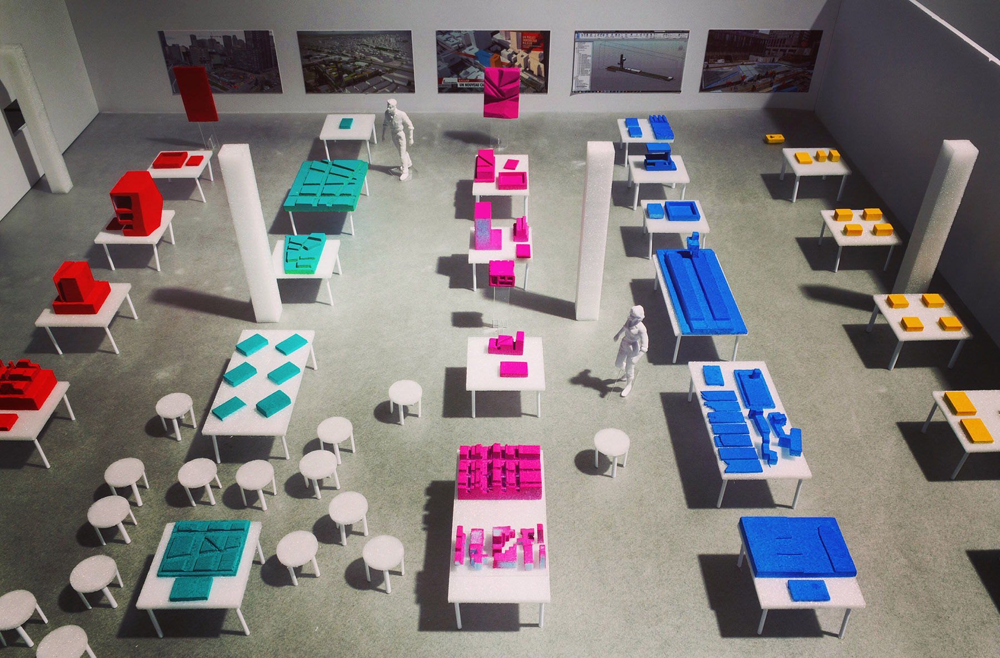
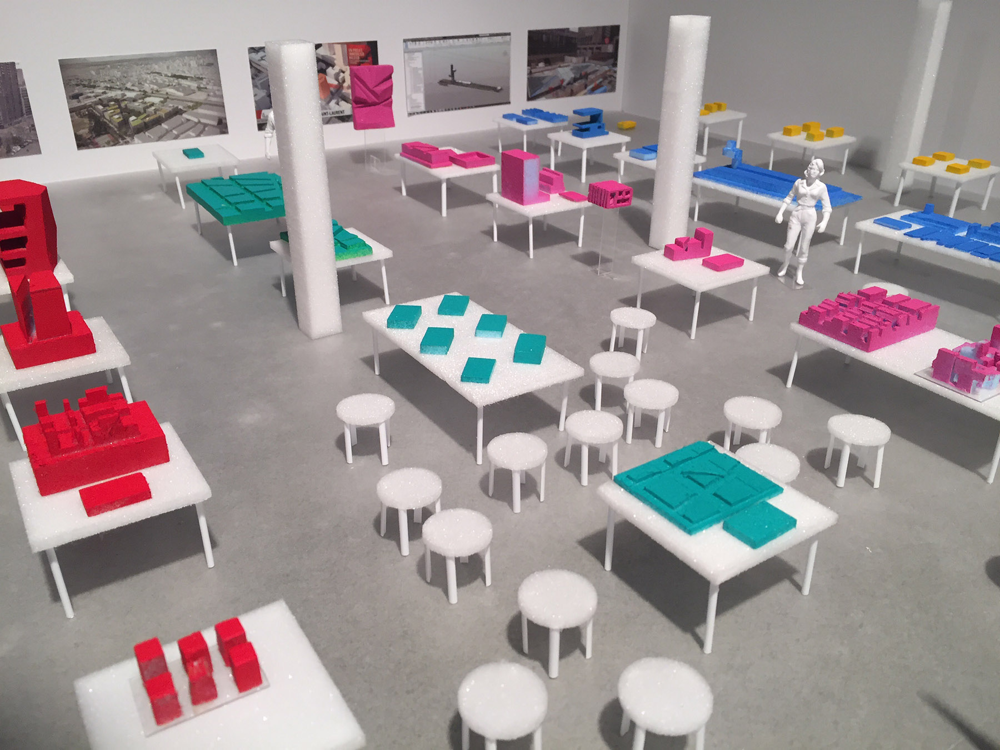

Exhibition design at the Université de Montréal showcasing the various models and modes of explorations for five ongoing projects at Provencher_Roy.

From the urban scale to furnitures through architecture, the comprehensive design approach of the firm was made explicit with various models and tools used across the office.

_made at [Provencher_Roy](http://provencherroy.ca/) with Nicolas Demers-Stoddart_
