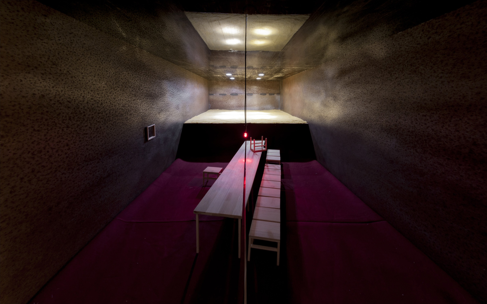
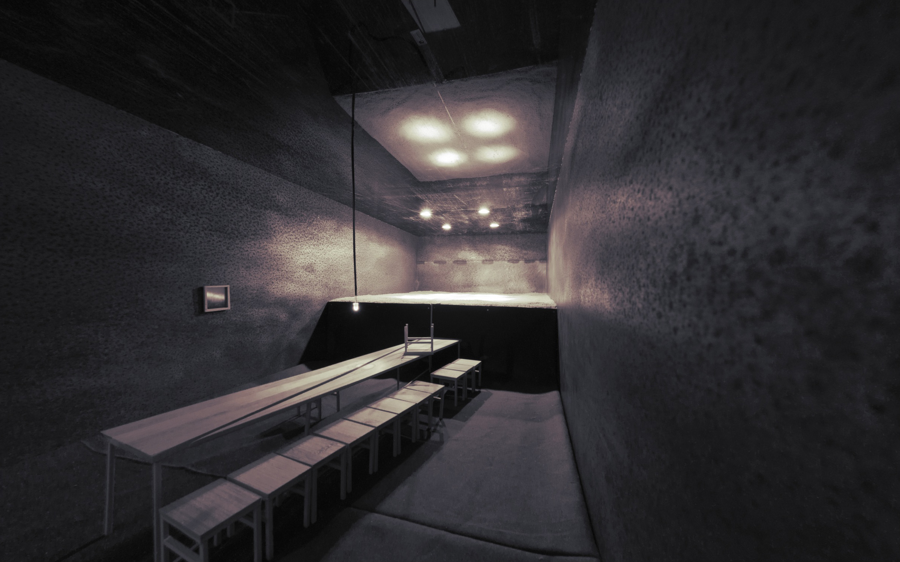

« La Cène, rouge et or:
Coup de théâtre en contraste;
Silence solennel. »

Contraste d’une vieille grange remplie de grains dorés et d’un tapis rouge sang. Nourriture inaccessible et tissu sensuel.

Maquette 1:10 d'un espace pour le dernier repas. Le mandat était de créer une image, en évitant les symboles.

Les projets des autres étudiants sont disponibles [sur cette
page](http://madeck.com/s/design_international-2011/) que j’ai montée pour l’occasion.
